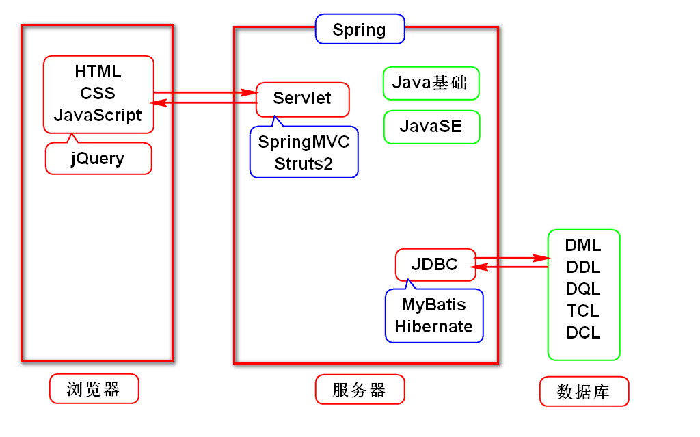
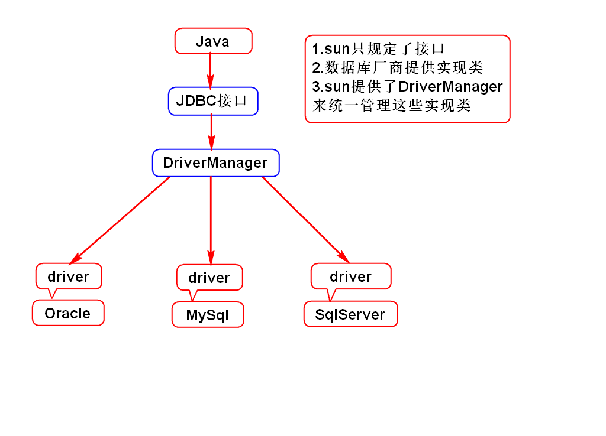
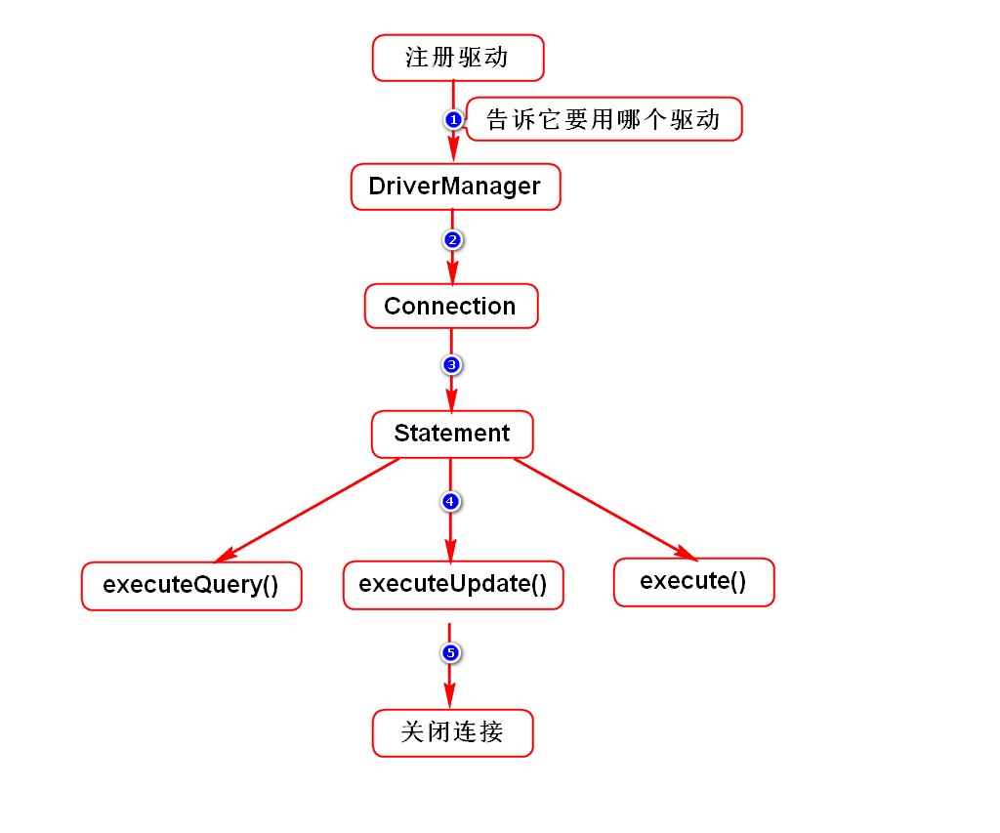
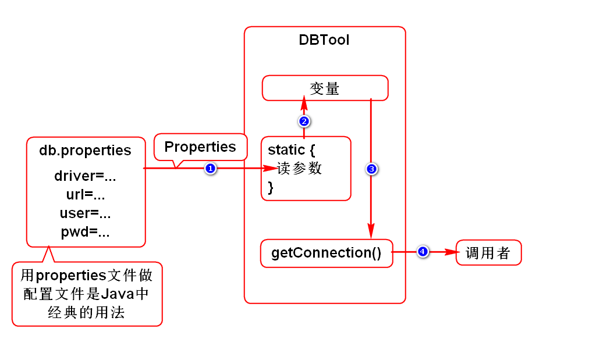

# 自我介绍
- 李洪鹤
- lihh@tedu.cn

# 一.Java体系结构

# 二.JDBC简介
## 1.要素

## 2.使用步骤

# 三.导包
## 1.搜索包
- 通过浏览器访问maven.tedu.cn
- 搜ojdbc,选择第2个
> 家里访问的是maven.aliyun.com

## 2.复制
- 在下方框内,将XML代码复制

## 3.粘贴
- 打开pom.xml最后的页签
- 手动增加一个标签<dependencies>
- 将代码粘贴到此标签内部,保存即可

## 4.失败了怎么办
- 删除.m2目录下面的失败的缓存文件
- 删除pom.xml中<dependencies>下失败的代码
- 重新导入此包
> .m2位置可以通过eclipse查看

# 四.DBTool
