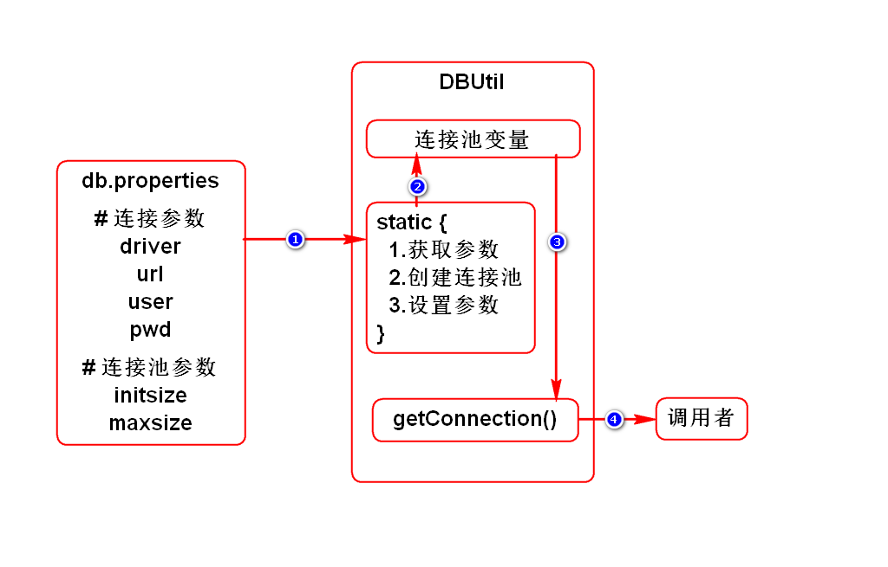
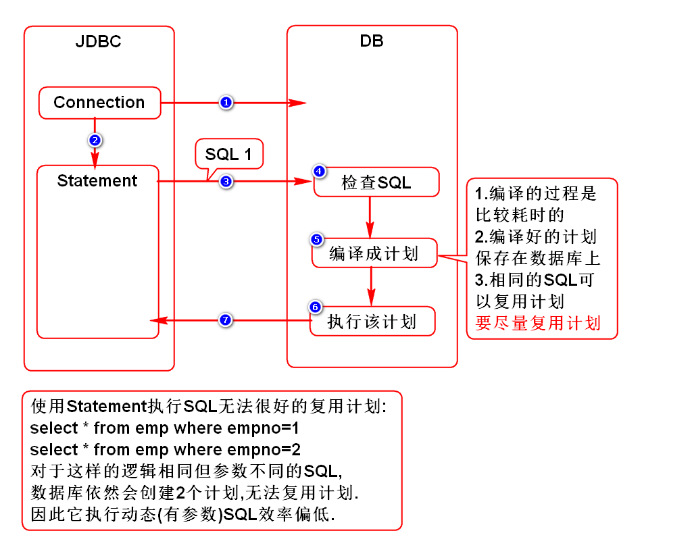
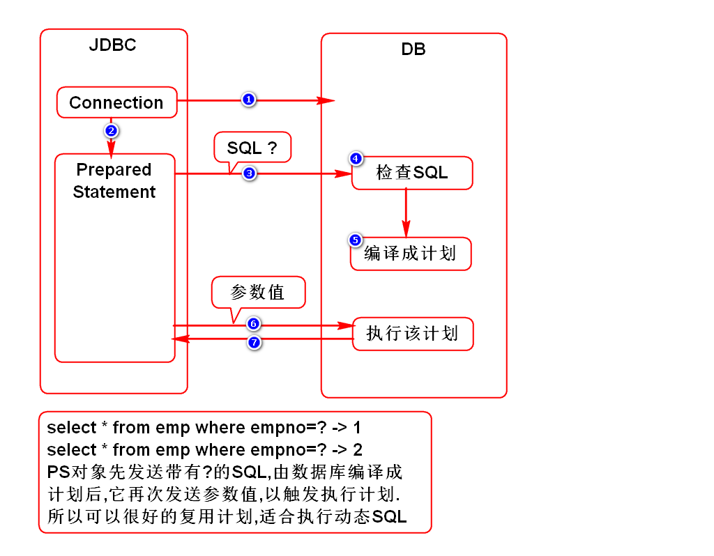
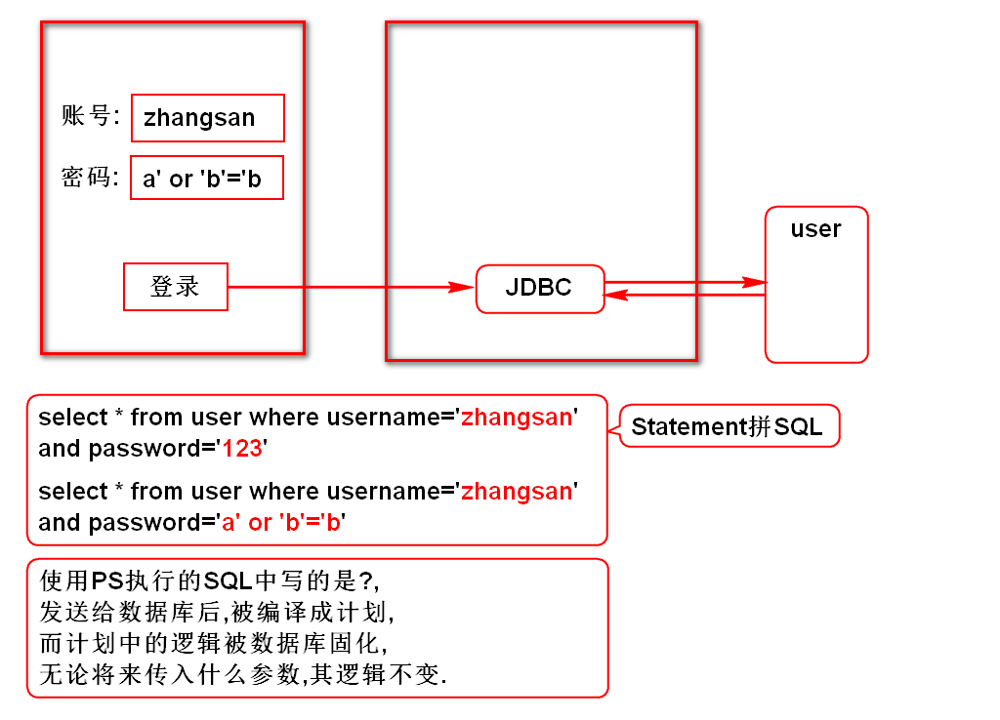
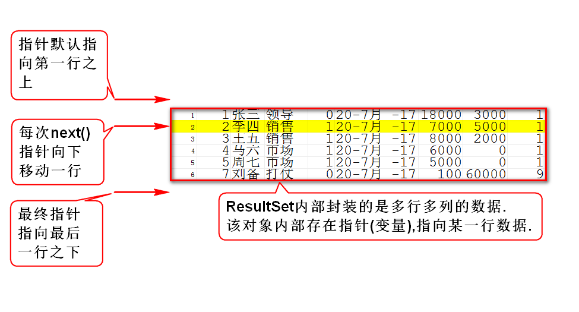

# 一.连接池(数据源)
## 1.使用DriverManager的问题
- 它没有管理连接的上限,当并发量过大时会导致数据库崩溃.
- 它每次都创建一个全新的连接,而不是复用连接,所以效率略低.

## 2.连接池的作用
- 它可以管理连接的上限,避免数据库崩溃.
- 它创建的连接可以反复使用,效率高.

## 3.工作场景
- 当创建连接池对象时,它会自动创建一批(配)连接,并将其设置为空闲态.
- 每次调用它时,它会返回一个空闲连接,并将其设置为占用态.
- 使用完连接后,将连接归还给连接池,它会将连接内数据清空,并设置为空闲态.
- 当连接池发现空闲连接快不够用(配)时,它会再次创建一批(配)连接.
- 当占用连接数已达上限(配)时,连接池会让新的调用者等待.
- 当高峰期过后,连接池会关闭一批(配)空闲连接.

## 4.常用连接池
- DBCP
- C3P0

## 5.连接池的用法
- sun规定了连接池的接口DataSource
- 由厂商来实现连接池(DBCP连接池中的实现类是BasicDataSource)

# 二.Statement和PreparedStatement
## 1.它们的联系
- 它们都是用来执行SQL的接口(实现类由厂商提供)
- PreparedStatement extends Statement

## 2.它们的区别(面试题)
- Statement适合执行静态(无参数)SQL
- PreparedStatement适合执行动态(有参数)SQL

## 3.Statement运行原理

## 4.PreparedStatement运行原理

## 5.PreparedStatement可以避免注入式攻击

# 三.ResultSet
## 1.指针

## 2.ResultSetMetaData
- Meta:元,本质、根本
- MetaData:元数据,即数据的本质(对数据的描述)
- ResultSetMetaData:结果集元数据,即对结果集描述的数据
> 如:多少列、列名、列类型

## 3.可滚动结果集
- 效率低,几乎不用

# 补充1:JDBC中的日期类型
- JDBC支持的日期类型是java.sql下的类型
- java.sql.Date 年月日
- java.sql.Time 时分秒
- java.sql.Timestamp 年月日时分秒毫秒
> 上述3个日期类型都是java.util.Date子类

