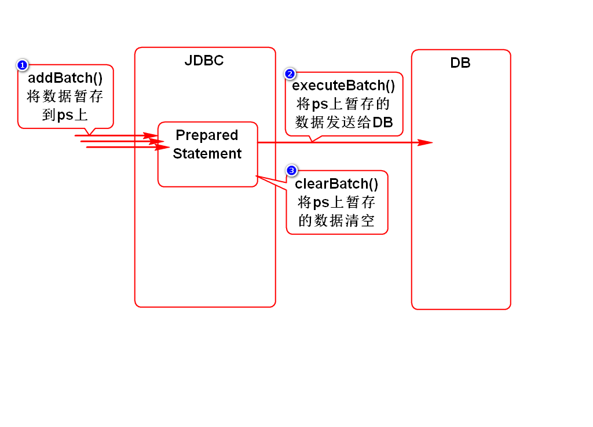
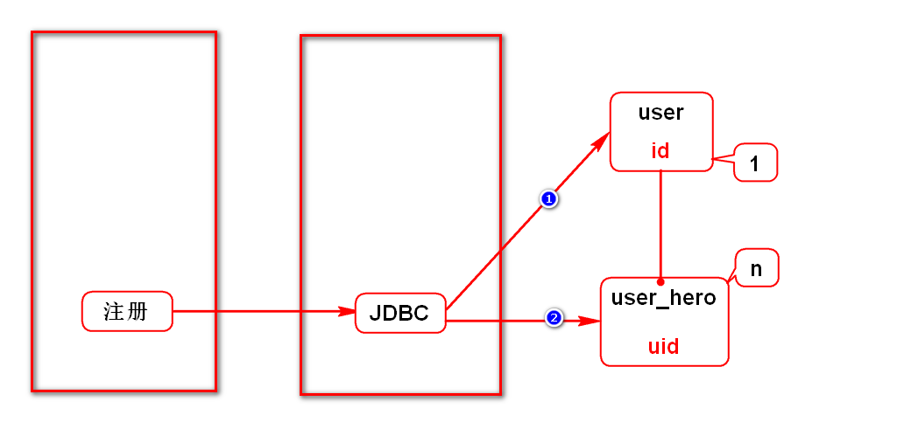
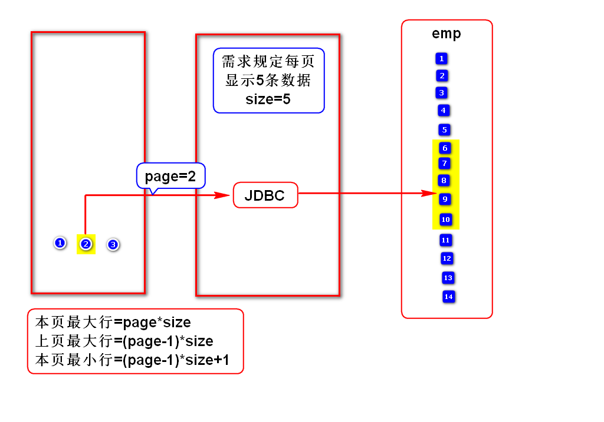
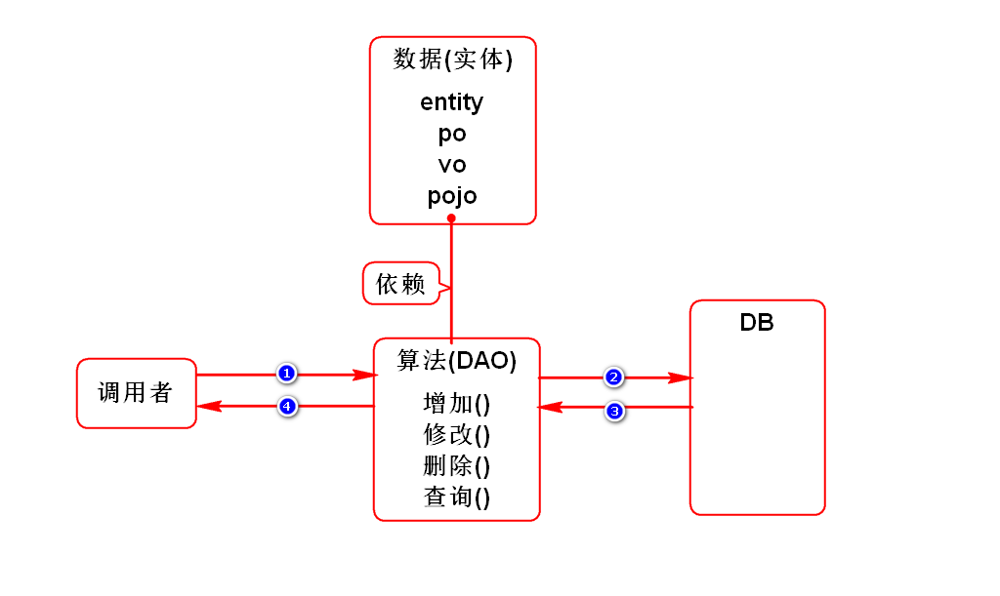

# 一.JDBC的事务管理
## 1.JDBC会自动管理事务
- 当调用executeUpdate()时,它会自动commit.
> 当一个业务内只包含一次DML操作时

## 2.JDBC支持手动管理事务
- 取消自动提交:conn.setAutoCommit(false);
- 提交事务:conn.commit();
- 回滚事务:conn.rollback();
> 当一个业务内包含多次DML操作时

## 3.什么是事务?
- 满足如下特征的数据库访问(操作/调用)叫事务:
- 原子性:事务前后的数据要完整,要么都成功,要么都失败
- 一致性:事务前后的数据要保持一致,即收支平衡
- 隔离性:事务过程中的数据不允许别人访问
- 持久性:事务一旦完成,就永久有效
> 事务是一个完整的概念,不要割裂去看.

# 二.批量添加
- 一般在导入的功能中会进行批量添加数据.
- 只有SQL相同的数据才能进行批量添加.

# 三.获取自动生成的主键
## 1.使用场景
- 注册时,先增加用户,再增加英雄
- 增加英雄时需要用到用户的ID

## 2.如何获取
### 反查
- insert into user values(seq.nextval,?,?)
- select id from user where username=?

### 先执行序列
- select seq.nextval from dual
- insert into user values(?,?,?)

### 通过ps获取自动生成的ID
- 详见案例

# 四.分页
## 1.假分页(内存分页)
- 第1次查询某表时,就查询出所有的数据,并存入内存(List).
- 第N次查询该表时,直接从内存(List)中取某一页数据.
- 特点:第1次查询巨慢,以后查询很快,耗内存.
> 适合数据量非常小的项目.

## 2.真分页(物理分页)*
- 每次查询某表,都使用分页SQL查出一页的数据
- 特点:每次查询都比较快,节约内存
> 适合所有的项目.

## 3.Oracle的分页SQL

	select * from (
	  select e.*,rownum r from (
	    select * from emps_lhh order by empno
	  ) e
	) where r between 11 and 20

## 4.分页SQL所需条件
- 已知条件:page和size
- 本页最大行 = page*size
- 本页最小行 = (page-1)*size+1

# 五.封装的思想
## 1.如何封装JDBC代码

## 2.关于DAO的说明
- DAO工厂和接口在后面的阶段讲解
> 因为当前阶段没有完整的WEB项目,没有具体的业务

# 补充1:JavaBean
- 满足如下规范的类:
- 必须有包
- 必须有无参构造器
- 必须实现序列化接口
- 通常有get和set方法