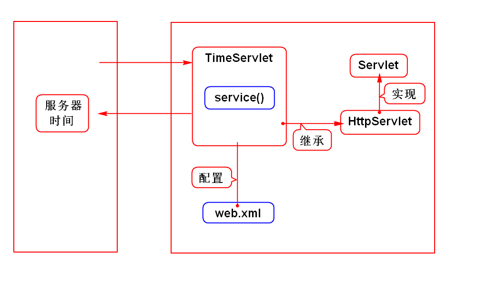
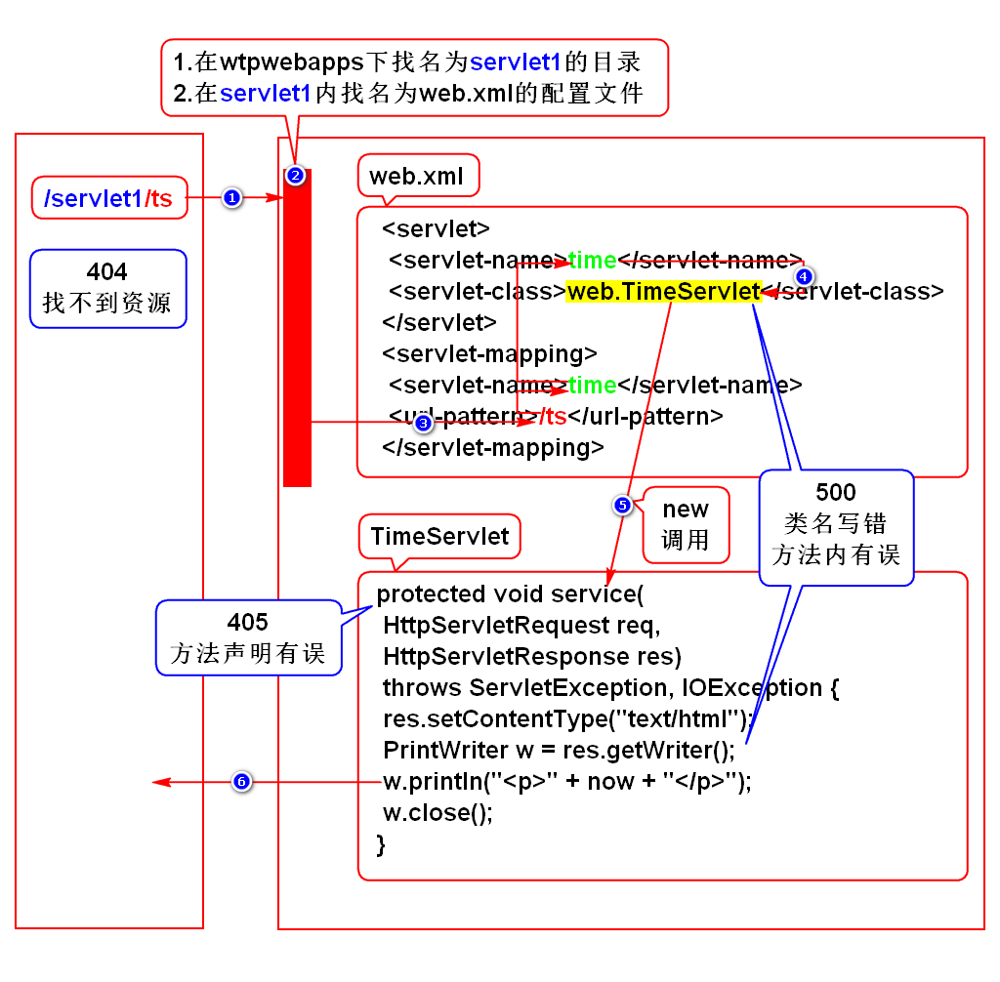

# 一.WEB项目演变
## 1.演变的规律
- 由单机向网络发展
- 由CS向BS发展

## 2.CS
- Client Server
- 客户端服务器程序
- 客户端需要单独开发,用户需要单独安装

## 3.BS
- Browser Server
- 浏览器服务器程序
- 使用现成的浏览器充当客户端,无需单独开发及安装

# 二.Servlet简介
## 1.服务器如何给浏览器返回网页?
### 1)静态网页
- w3school,百科,新闻
- 每个人看到的内容都一样,没有变化
- 服务器保存并发送的是html文件

### 2)动态网页
- 百度,淘宝,微博
- 每个人看到的内容有区别,富有变化
- 服务器保存对象,由此对象动态拼网页并发送网页
> Java语言中这个可以拼网页的对象就是Servlet

## 2.Servlet特征
- Servlet存储在服务器上
- Servlet需要满足sun的规范
- Servlet可以拼动态资源(HTML,图片等)
> 术语:可以处理HTTP协议

## 3.什么是Servlet?
- 是sun推出的用于在服务器端处理HTTP协议的组件
> 组件:就是满足规范的对象

# 三.服务器
## 1.名词解释
- Java服务器
- Web服务器
- Java Web 服务器
- Servlet容器

## 2.本质
- 是一个能运行其他项目的软件

## 3.举例
- Tomcat(Apache)
- JBOSS
- WebLogic
- WebSphere

# 四.Tomcat使用方式
## 1.单独使用(软件上线时)
### 1)下载及安装
- Apache官网 或 doc.tedu.cn/tomcat/index.html
- 它是绿色版软件,解压缩即可用
> 学生机已经安装好了(/home/soft01/tts9)

### 2)配置环境变量
- 配置好JAVA_HOME

### 3)启动服务器
#### Linux
- 打开/tomcat/bin目录,打开终端,输入chmod +x *sh
- 打开/tomcat/bin目录,打开终端,输入./startup.sh

#### windows
- 打开/tomcat/bin目录,双击startup.bat

### 4)访问服务器
- 在浏览器上输入 http://localhost:8080
- 回车后看到一只猫则代表成功了

### 5)关闭服务器
#### Linux
- 打开/tomcat/bin,打开终端,输入./shutdown.sh

#### windows
- 打开/tomcat/bin,双击shutdown.bat

## 2.通过Eclipse调用(平时开发时)
### 1)配置步骤
- 参考doc.tedu.cn/tomcat/index.html

### 2)配置失败了怎么办?
- 重新配置,前提是
- 先删除配置过的tomcat
- window->preference->server->runtime->选择tomcat->remove
- 再删除自动生成的Servers项目
- 选择项目(Servers)->右键delete->勾选delete->ok

## 3.常见问题
### 1)问题的特征
- Address already in use 8080
- 原因:tomcat端口被占用
> 可能出现在弹出框里,也可能出现在控制台

### 2)tomcat重复启动导致
- 打开终端,通过命令shutdown强制关闭tomcat

### 3)其他软件的端口冲突导致
- Oracle端口也是8080
- 打开tomcat配置文件server.xml,在约65行修改端口
> 该配置文件在Servers项目之下

# 五.Servlet开发步骤
## 1.创建项目
- 创建WEB项目,要求具备如下目录结构
- /webapp/WEB-INF/web.xml

## 2.导javaee开发包
### 1)通过maven搜javaee
- 在搜索结果中选择最后一个javaee-api

### 2)依赖tomcat自带的jar包
- 项目->右键properties->target runtimes->勾选tomcat->apply->ok

## 3.开发Servlet
- 创建一个类,继承于HttpServlet,或实现Servlet接口
- 重写父类的service()

## 4.配置Servlet
- 在web.xml中进行配置

## 5.部署项目
- Servers视图->右键tomcat->Add and Remove->将项目移动到右侧->Finish
- 启动tomcat则完成了部署
- 部署的代码在/tomcat/wtpwebapps下面
> 部署:拷贝的术语

## 6.访问Servlet
- 打开浏览器,输入
- http://localhost:8080/servlet1/ts

## 7.重新部署
- 修改代码后,需重新部署
- Servers视图->右键tomcat->publish

## 案例

# 六.程序执行过程

# 七.HTTP协议
## 1.什么是HTTP协议
- 就是W3C制定的规范
- 规定了浏览器和服务器如何通信以及通信的数据格式
> 参考rfc2616.txt(HTTP1.1)

## 2.如何通信
- 建立连接
- 发送请求
- 接收响应
- 关闭连接
> 优点:每次请求都创建新连接,可以降低服务器压力.

## 3.数据格式
### 1)请求数据
- 请求行:请求的基本信息
- 消息头:实体内容的描述信息
- 实体内容:向服务器发送的业务数据

### 2)响应数据
- 状态行:响应的基本信息
- 消息头:实体内容的描述信息
- 实体内容:向浏览器发送的业务数据

## 4.开发时需处理的内容
### 1)不需要我们处理的内容
- 通信的4个步骤已经由浏览器和服务器实现了
- 请求数据中的请求行、消息头由浏览器自动填写
- 响应数据中的状态行、消息头由服务器自动填写

### 2)需要我们处理的内容
- 处理请求数据中的实体内容(request)
- 处理响应数据中的实体内容(response)
> 我们只需要学会使用request和response即可

