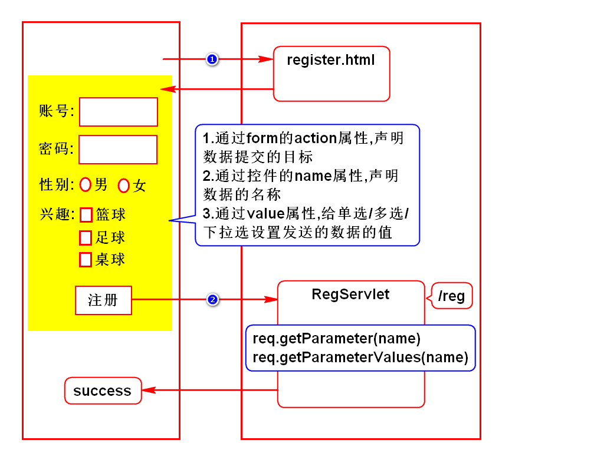
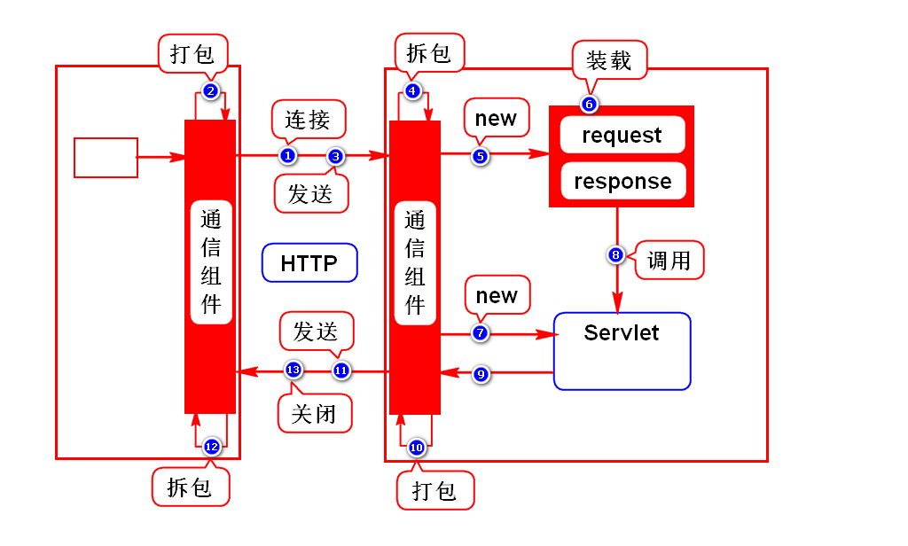
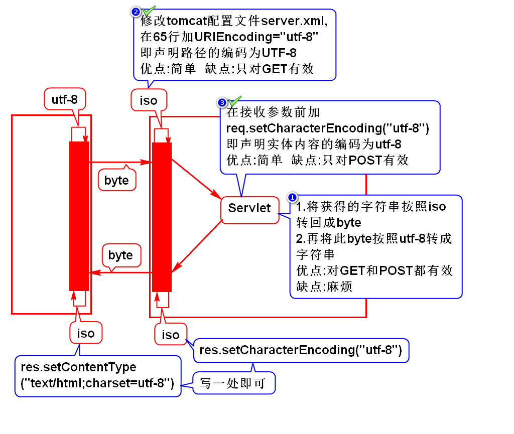
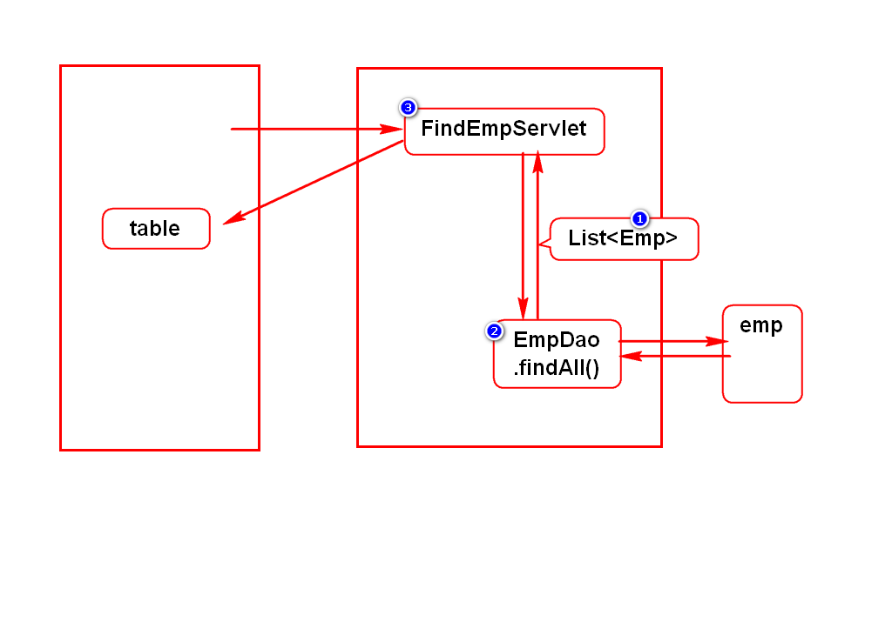
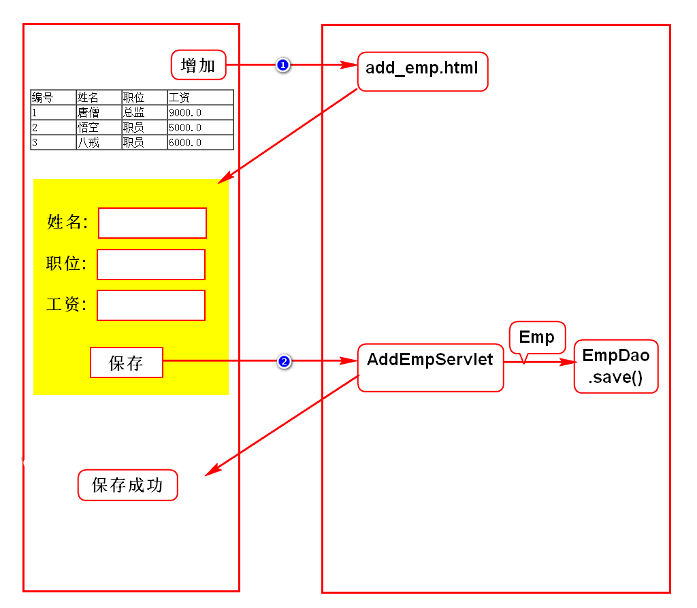

# 一.注册案例

# 二.Servlet运行原理
- 第1,2,3,4,10,11,12,13步是浏览器和服务器通信及发送数据的步骤
- 这些步骤的底层就是采用socket通信实现的(参考聊天室案例理解)
- 第5,6,7,8步是服务器帮助我们创建对象并调用对象的步骤

		HttpServletRequest req = new RequestFacade();
		HttpServletResponse res = new ResponseFacade();
		req.setXXX();
		res.setXXX();
		RegServlet  s = new RegServlet();
		s.service(req,res);

# 三.请求方式
## 1.什么是请求方式
- 浏览器向服务器发送业务数据的方式

## 2.常用的请求方式
- GET 和 POST

## 3.GET和POST的区别(面试题)
### GET
- 采用路径传参
- 参数在传递过程中可见,所以隐私性差
- 路径的大小有限制,所以只能传少量参数
> 默认所有的请求都是GET请求

### POST
- 采用实体内容传参
- 参数在传递过程中不可见,所以隐私性好
- 实体内容专门用于传参,大小不受限制
> 若在form上加method="post"则为POST请求

## 4.使用建议
- 传递的数据中有需要保密的数据时用POST
- 传递的数据较多时用POST
> 通常查询用GET,增加、修改保存数据时用POST

# 四.乱码解决方案

# 五.查询员工

# 六.增加员工
