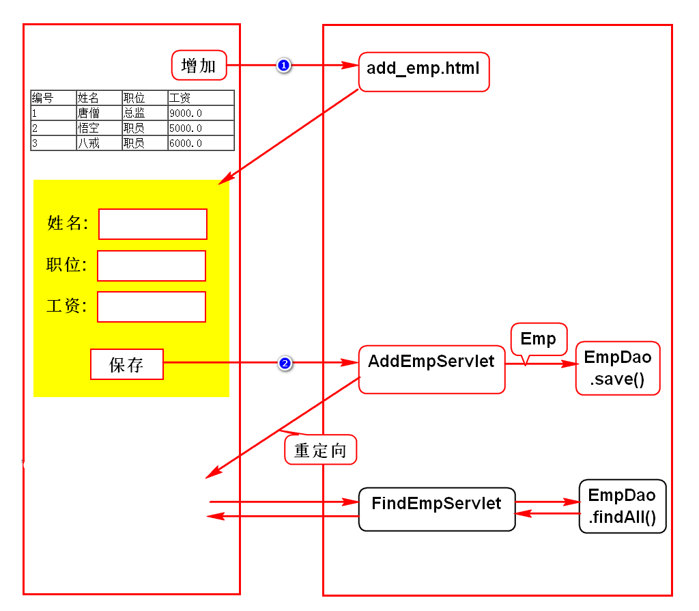
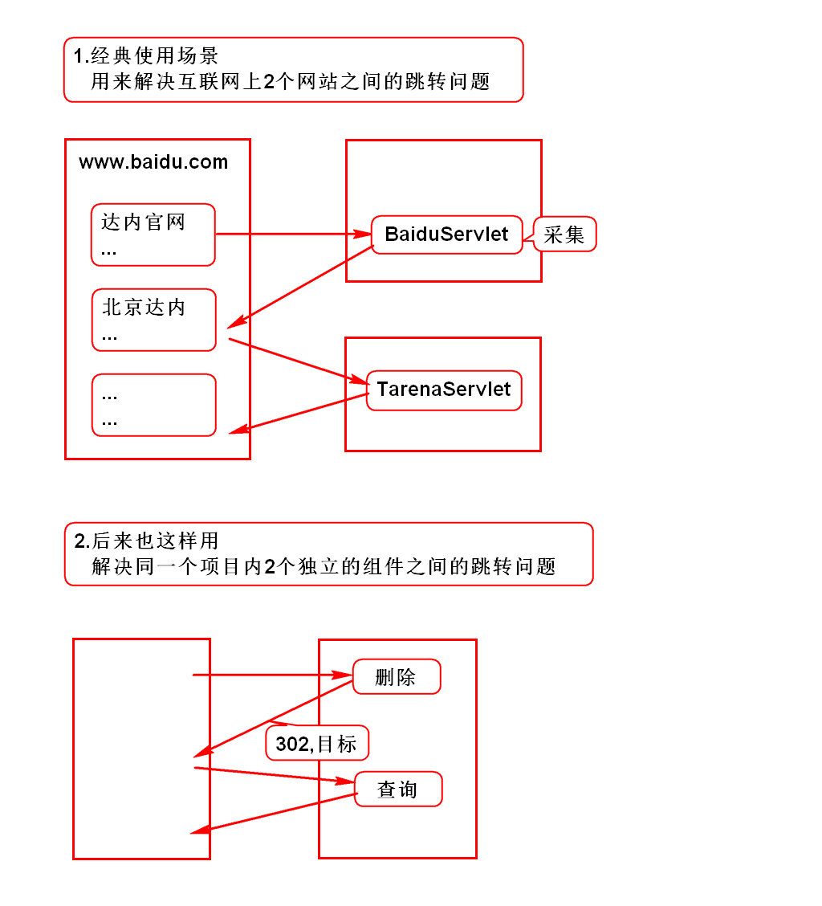
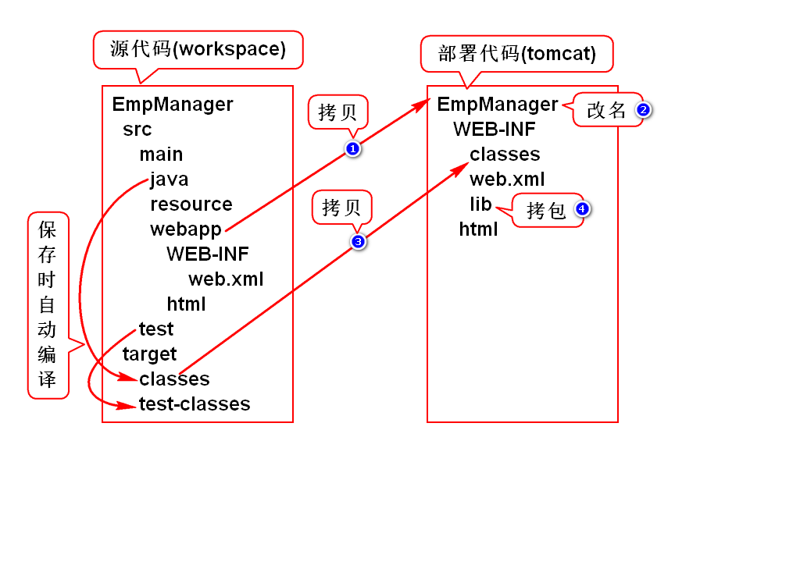
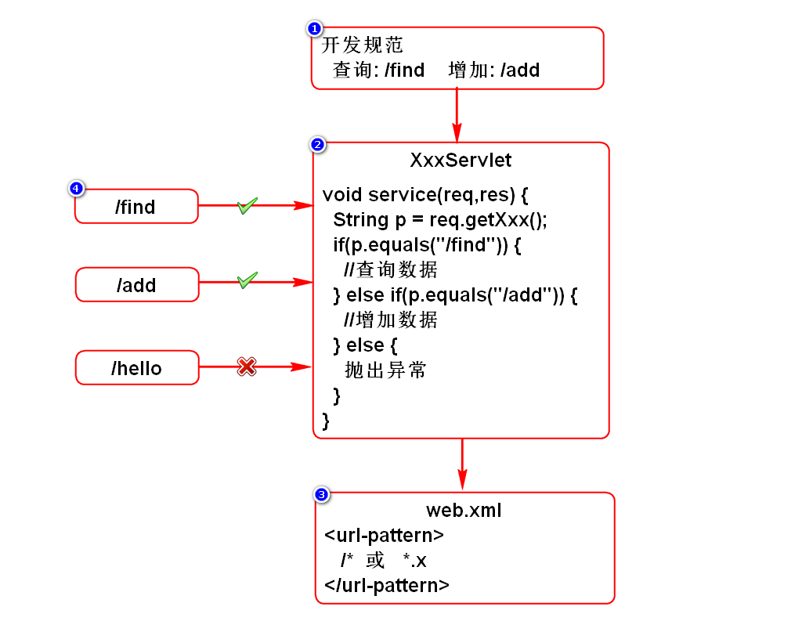
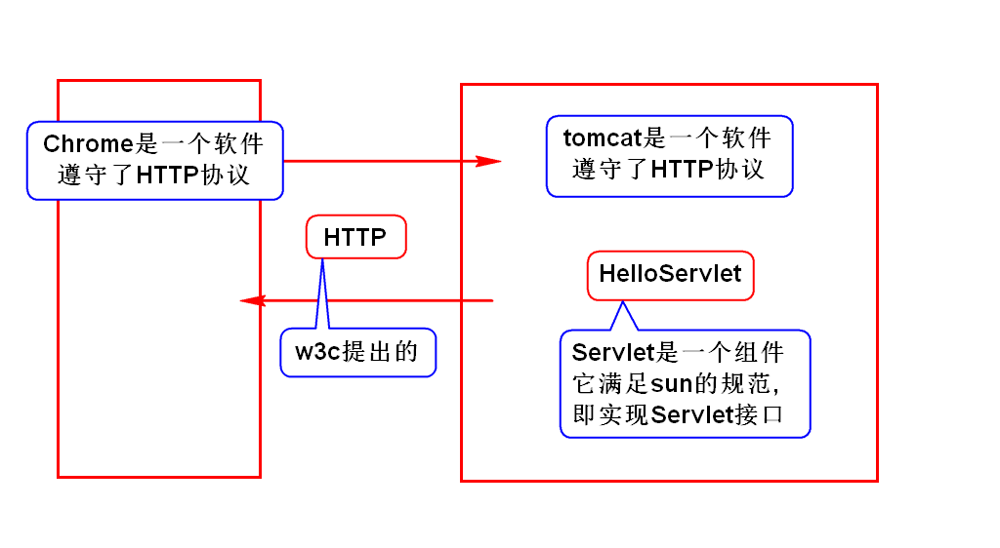
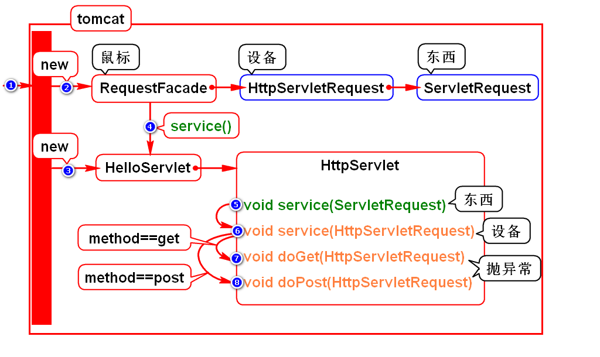
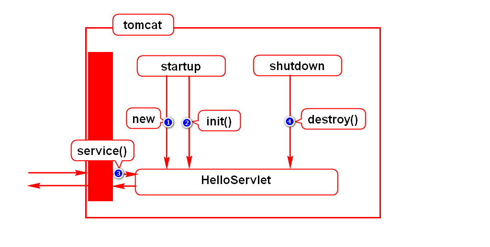
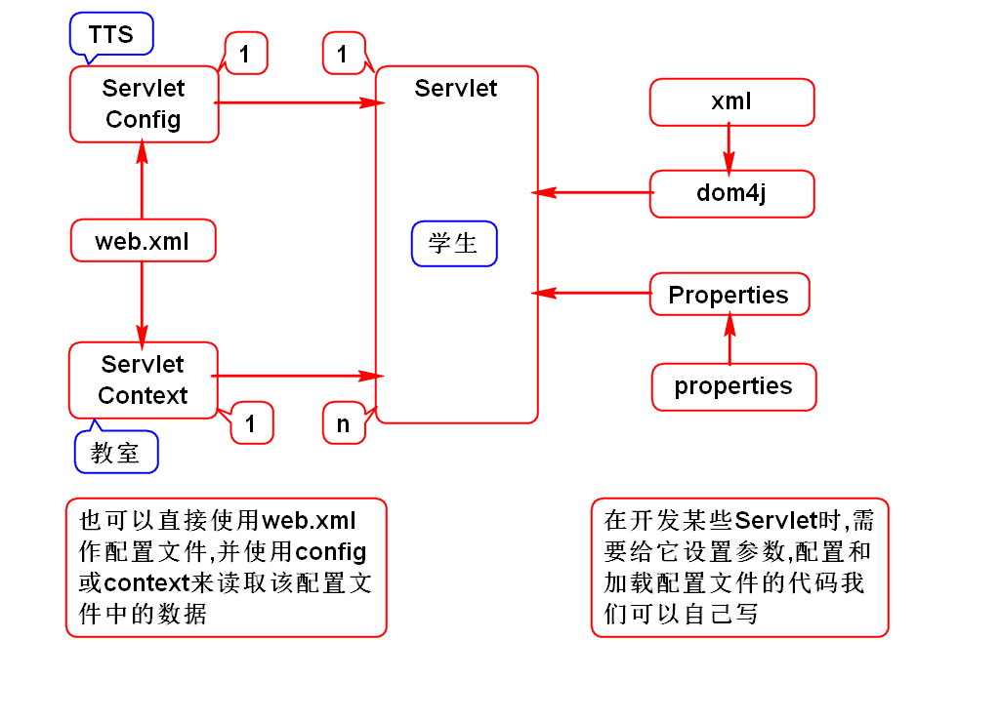

# 一.完善增加员工案例

# 二.重定向
- 重定向是一种特殊的响应
- 响应的信息包括状态码302以及访问的目标
- 其中状态码由服务器自动填写,而访问目标由我们设置

# 三.路径问题
## 1.项目部署的过程
- 所谓的访问路径都是针对部署代码而言的.
- 静态资源(HTML/图片等):
- 就是它在tomcat内存放的位置,如/EmpManager/add_emp.html
- 动态资源(Servlet):
- 就是在web.xml中声明的网名,如/EmpManager/addEmp
> 服务器根据网名找到类的方式参考day01中的程序执行过程

## 2.如何获取访问路径
- 项目名:request.getContextPath()
- 网名:request.getServletPath()
- 绝对路径:request.getRequestURI()
- 完整路径:request.getRequestURL()

## 3.URI和URL的区别
### 1)狭义的理解
- 从Java项目中观察
- URI:绝对路径
- URL:完整路径
- URL包含了URI

### 2)广义的理解(*)
- 从任意的WEB项目理解
- URI:一个资源的名字
- URL:一个资源的真名
- URI包含了URL

## 4.如何配置Servlet访问路径
### 1)精确匹配
- 如/hello
- 只有/hello这一个路径可以访问HelloServlet
- HelloServlet只能处理这一个请求

### 2)通配符匹配
- 如/*
- 所有的路径都可以访问HelloServlet
- HelloServlet能处理所有请求

### 3)后缀匹配
- 如*.abc
- 所有以abc为后缀的路径都可以访问HelloServlet
- HelloServlet可以处理相似的一批请求

## 5.如何使用一个Servlet处理多个请求?

# 四.扩展内容
## 1.web项目相关的概念和规则

## 2.HttpServlet
### 1)图例
- 蓝色框:接口
- 红色框:类
- 绿色字:public
- 黄色字:protected

### 2)要点
- RequestFacade是服务器提供的实现类
- 服务器实例化并调用的是web.xml中我们配置的Servlet
- 服务器调用的是子Servlet中的公有的service()
- 无论子Servlet是否重写此方法,它都有此方法(继承)
- HttpServlet中的方法相互调用,重写哪一个都能解决问题
- doGet()和doPost()内部直接抛出异常,强制开发者重写

## 3.Servlet生命周期
- 默认情况下,用户第一次访问Servlet时,tomcat会实例化它
- 可以修改为,启动服务器时,就让服务器自动实例化Servlet
- 第1,2,4步只执行一次,所以每个类型的Servlet都是单(个实)例

## 4.ServletConfig和ServletContext
- 它们都能加载web.xml中的参数,给Servlet使用
- config和Servlet是一对一关系,config中的参数只能给某一个Servlet使用
- context和Servlet是一对多关系,context中的参数可以给所有Servlet使用
> 它们和Servlet的关系由服务器保障的

