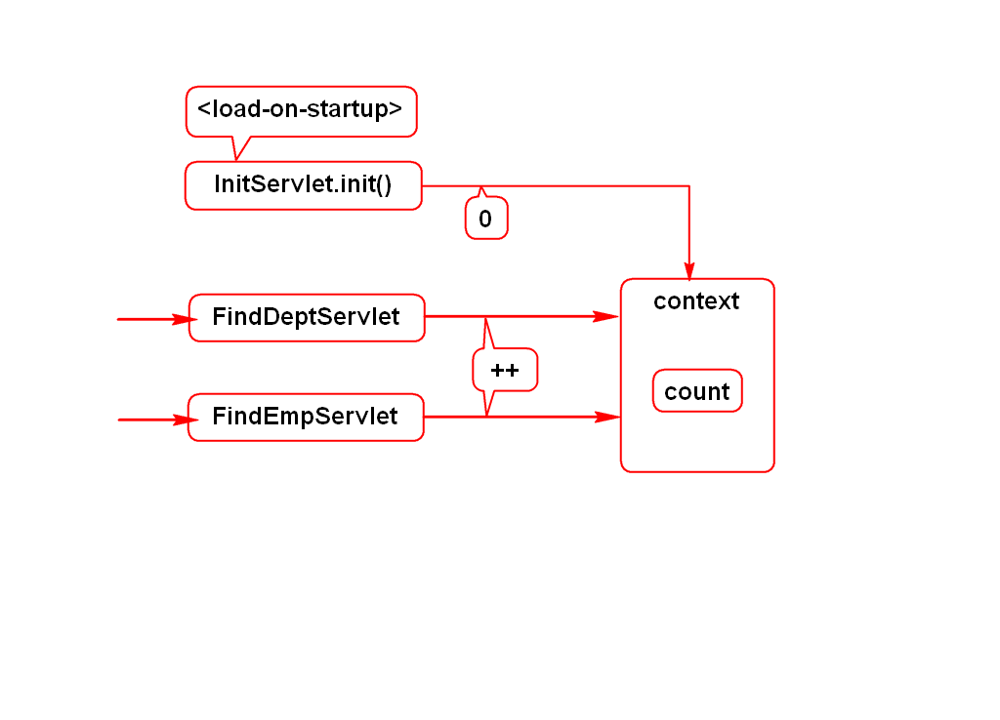
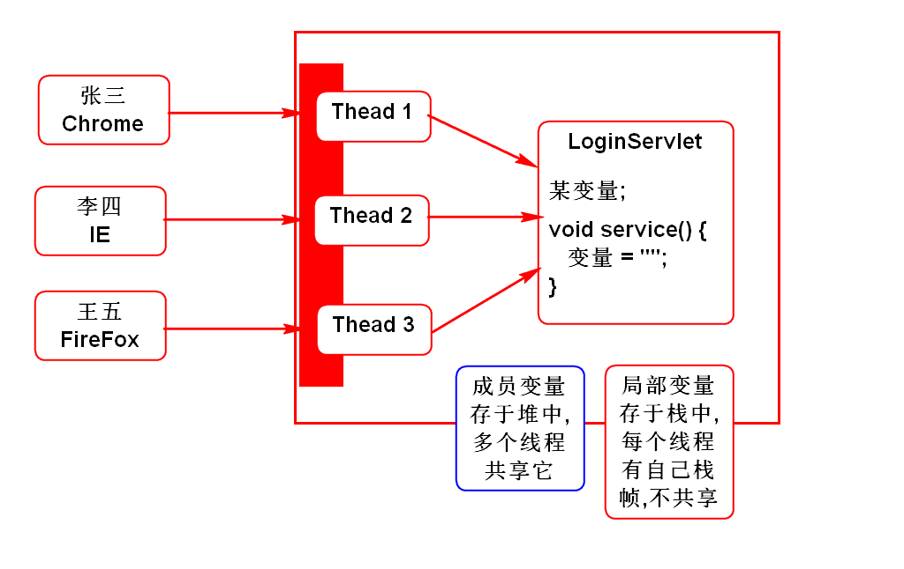
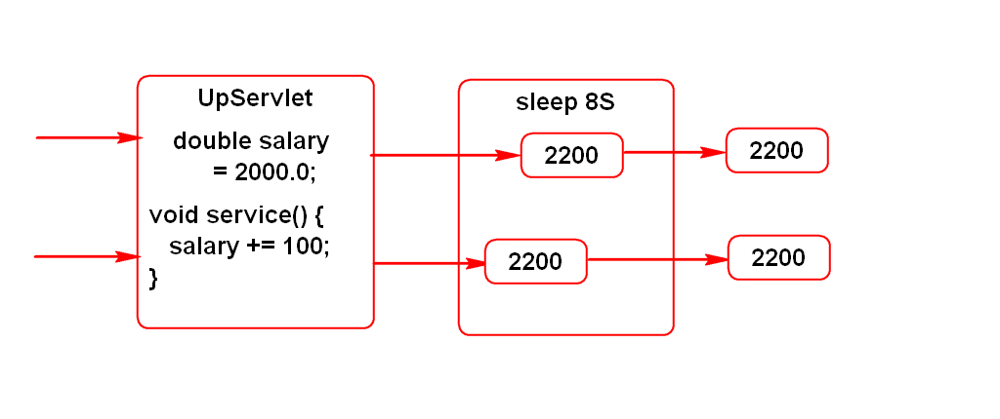
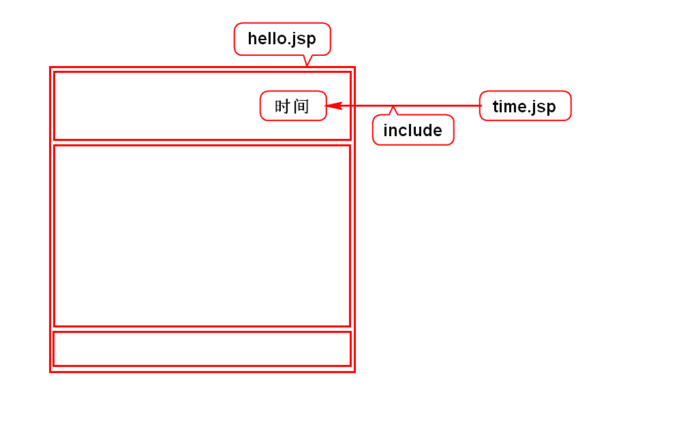
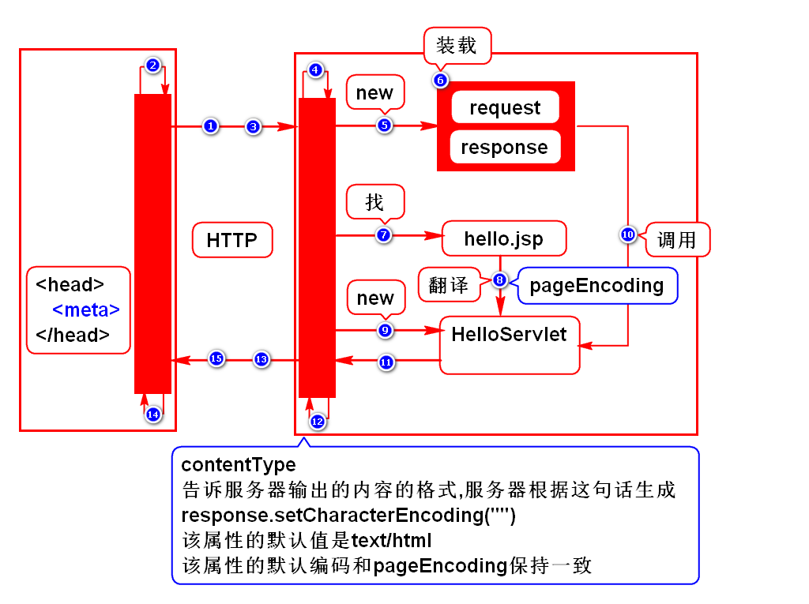
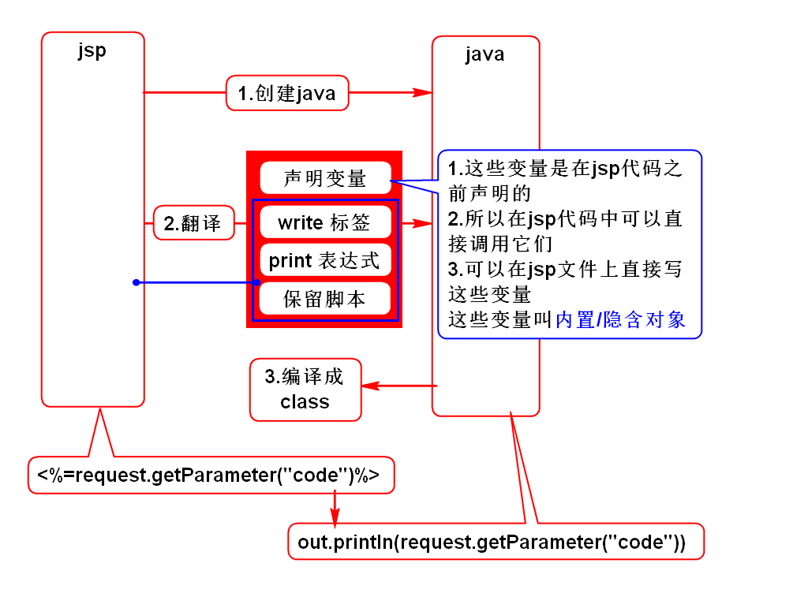

# 一.config和context的应用
## 1.config
- 假设要开发一个页游,要限制最大在线人数
- 即在登录功能(LoginServlet)中判断当前人数是否已达上限(maxOnline)
- maxOnline要求可配,由于只有登录功能使用它,通过config读取即可

## 2.context
- 很多查询功能都需要支持分页
- 而分页的已知条件size要求可配置
- size需要在很多功能中复用,通过context读取

## 3.context其他功能
- 它不但能读取web.xml中的常量,还能存取变量
- setAttribute(name,value)/getAttribute(name)
- 假设要开发一个统计网站流量的功能
- 即在用户访问网站任意功能时都要累加一个流量
- 流量是一个变量,任何功能都要使用它,所以存入context合适

# 二.Servlet线程安全问题
## 1.简介
- Servlet是在多线程环境下调用的,是有可能存在线程安全问题的
- 加锁

## 2.案例

# 三.jsp
## 1.jsp的作用
- 和Servlet一样,是服务器端处理HTTP协议的组件
> jsp可以向浏览器输出动态网页

## 2.include

## 3.jsp原理
- jsp本质上就是Servlet
- jsp向浏览器输出的结果是HTML

## 4.翻译的过程

## 5.jsp隐含(内置)对象(面试题)
### 1)request(*)
- HttpServletRequest

### 2)response
- HttpServletResponse

### 3)out
- JSPWriter
> 等同于PrintWriter

### 4)config
- ServletConfig

### 5)application
- ServletContext

### 6)exception
- Throwable
> 就是jsp所生成的Servlet中报的错

### 7)session(*)
- HttpSession
> 将来再讲

### 8)page
- 类型是Object
- 值是this
- 指代jsp所生产的那个Servlet

### 9)pageContext(*)
- PageContext
- 是一个管理者,通过它可以获得其他8个隐含对象

## 6.如何使用隐含对象
- 隐含对象可以直接在jsp上调用
- 因为它们是在jsp代码执行前就声明好了的

		<%=request.getParameter("")%>

		<%String user = request.getParameter("");%>