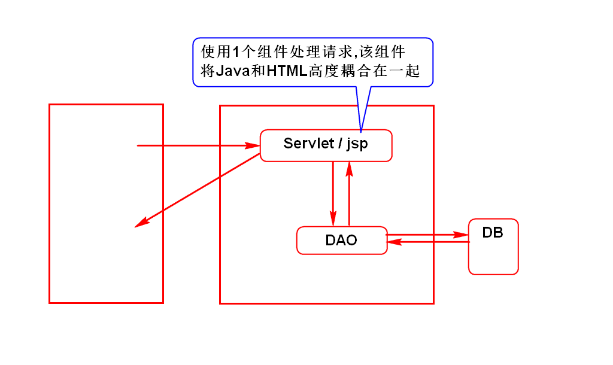
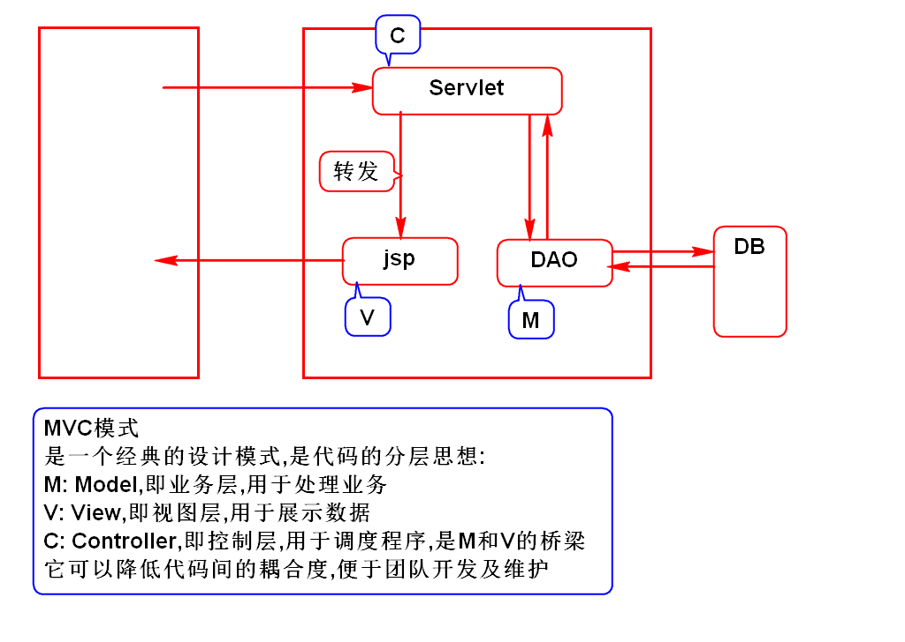
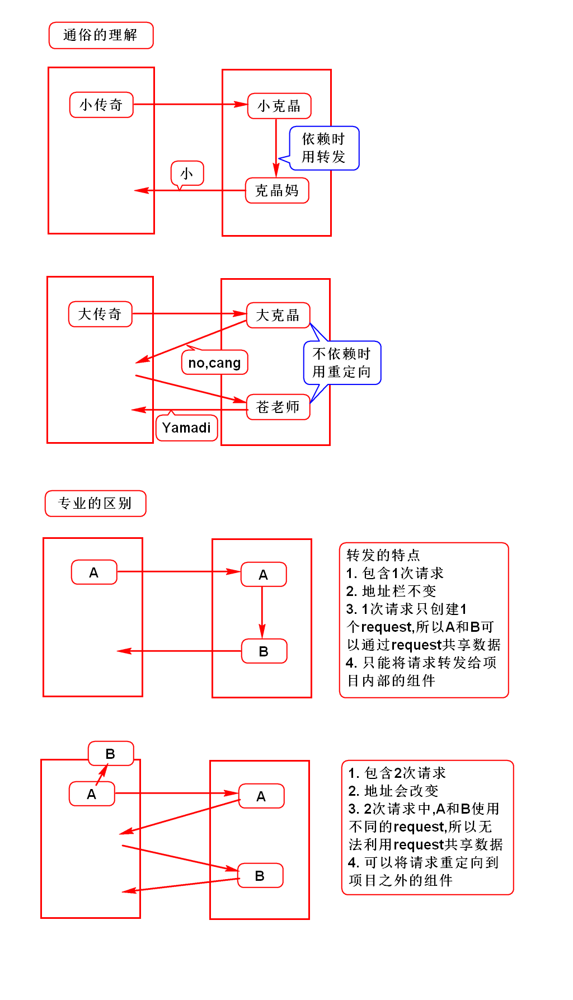
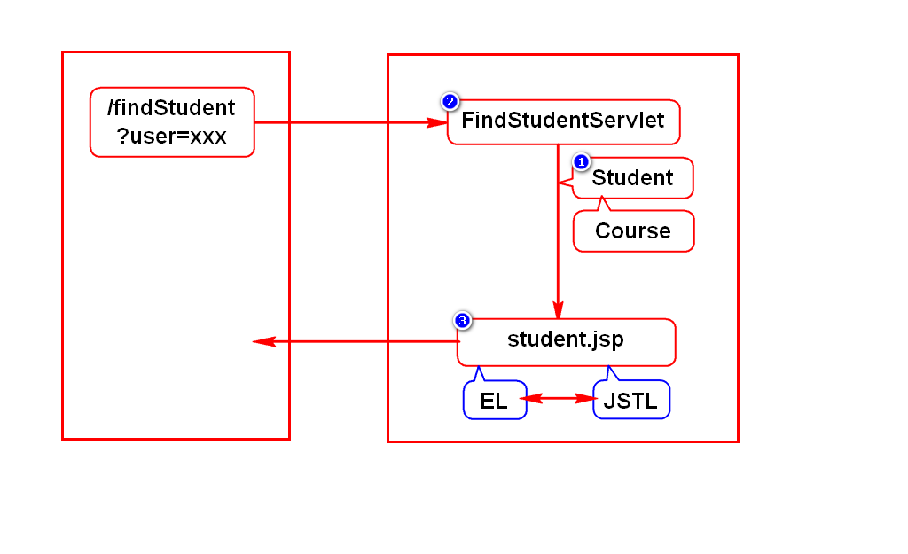
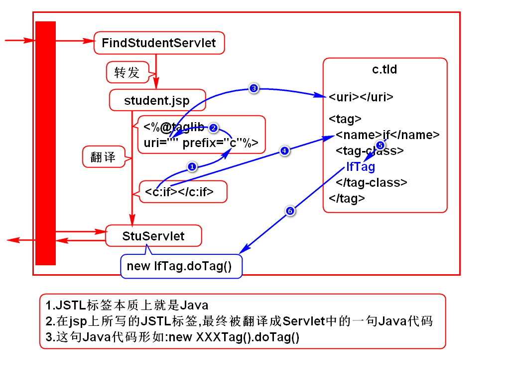

# 一.开发模式
## 1.Model 1

## 2.Model 2 (面试题)

# 二.转发和重定向
## 1.相同点
- 用来解决2个WEB组件之间的跳转问题
> WEB组件:Servlet,jsp

## 2.不同点(面试题)

## 3.使用建议
- 通常查询时用转发
- 通常增加、修改、删除后重定向到查询

# 三.EL和JSTL
## 1.案例

## 2.JSTL原理

## 3.自定义JSTL
