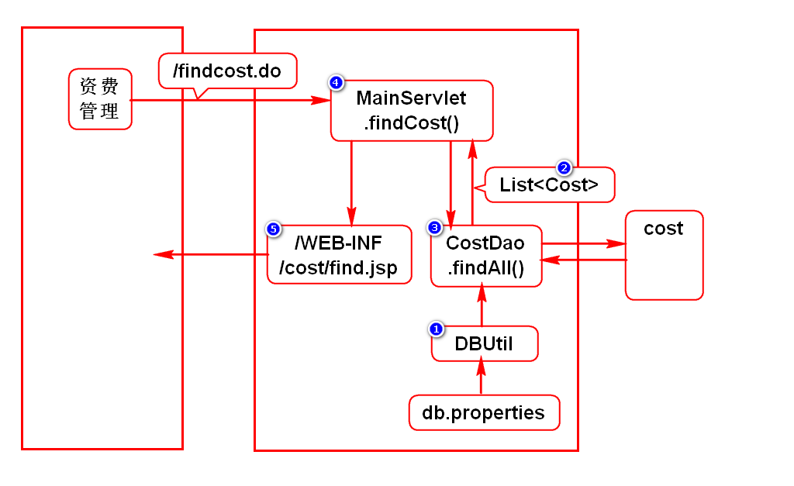
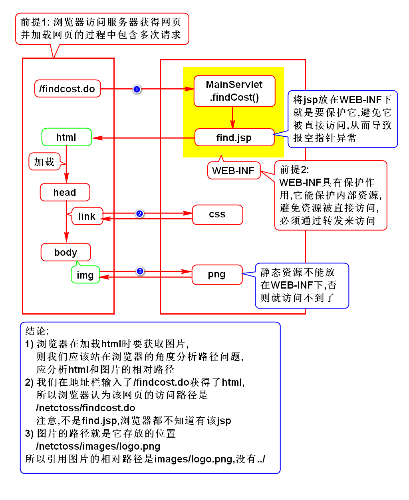
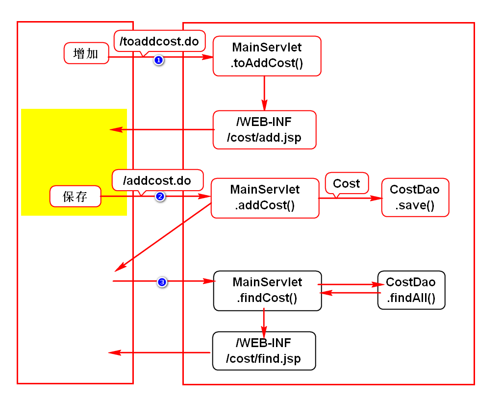

# 一.项目简介
## 1.名词解释
- NETCTOSS
- C:China
- T:Telecom 电信
- O:Operation 运营
- S:Support 支持
- S:System 系统
- 中国电信运营支持系统-网络版
> 该项目是电信公司给前来租服务器的客户开户用的软件

## 2.开发步骤
### 1)需求
- 和需求人员探讨需求
> 一定是在明确需求的前提下再开发

### 2)设计(*)
- 分析当前功能包含几次请求
- 描述(图/字)出每个请求的执行过程
> 用户的每项操作通常都对应一次请求

### 3)开发
- 按照请求执行过程倒序开发

### 4)单元测试
- 自己详细测试该功能

## 3.导包
- JavaEE:依赖tomcat内置的包
- JSTL:用maven搜jstl,选择1.2
- jdbc:用maven搜ojdbc,选择10.2.0.4.0
- dbcp:用maven搜commons-dbcp,选择1.4

# 二.查询资费
## 1.开发步骤

## 2.一些问题
### 1)如何格式化jsp中的日期
- 使用fmt.tld中的formatDate标签

### 2)3个相关联的问题
- 为什么find.jsp上引入样式/图片不需要写../
- 为什么jsp要放在WEB-INF下
- 为什么静态资源(css/img/html等)不放在WEB-INF下

# 三.资费增加
- 状态默认为暂停态,即status='1'
- 记录开通时间,即creatime=sysdate
- 状态非开通,所以startime=null
> 上述3个默认值,在写insert语句时直接赋值

