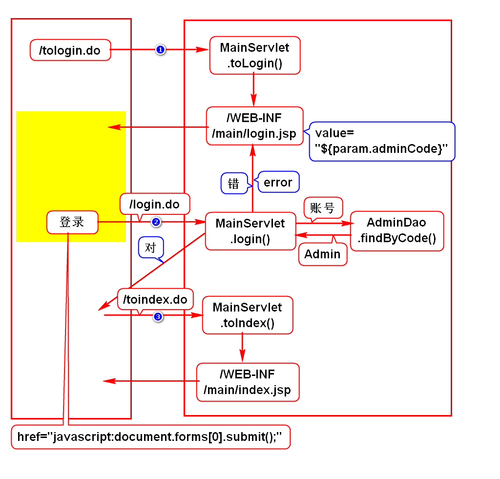
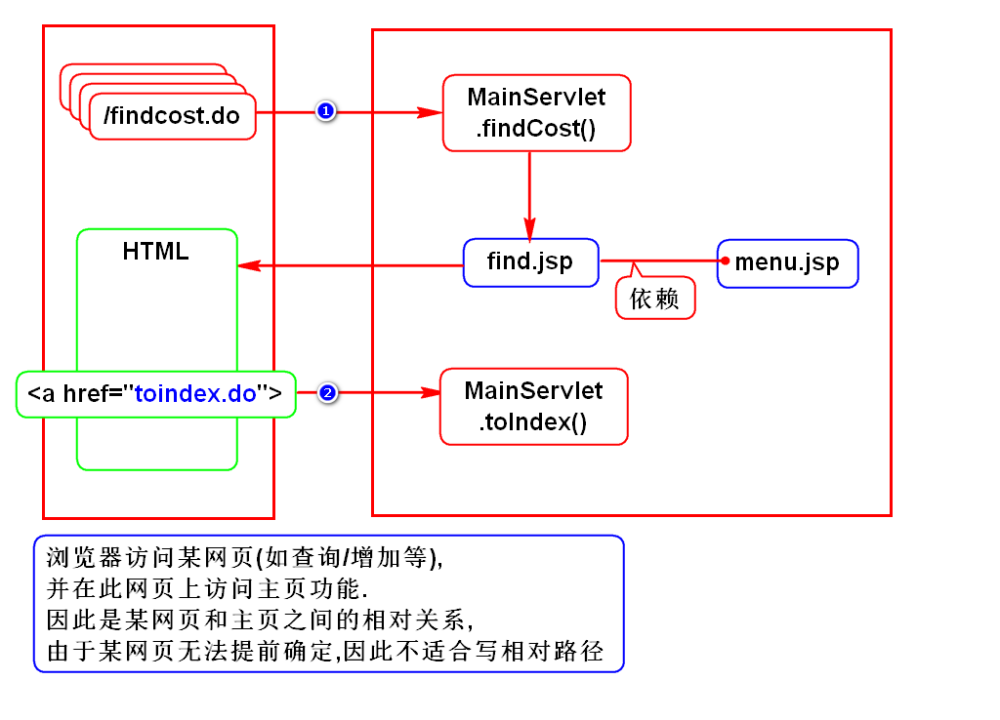
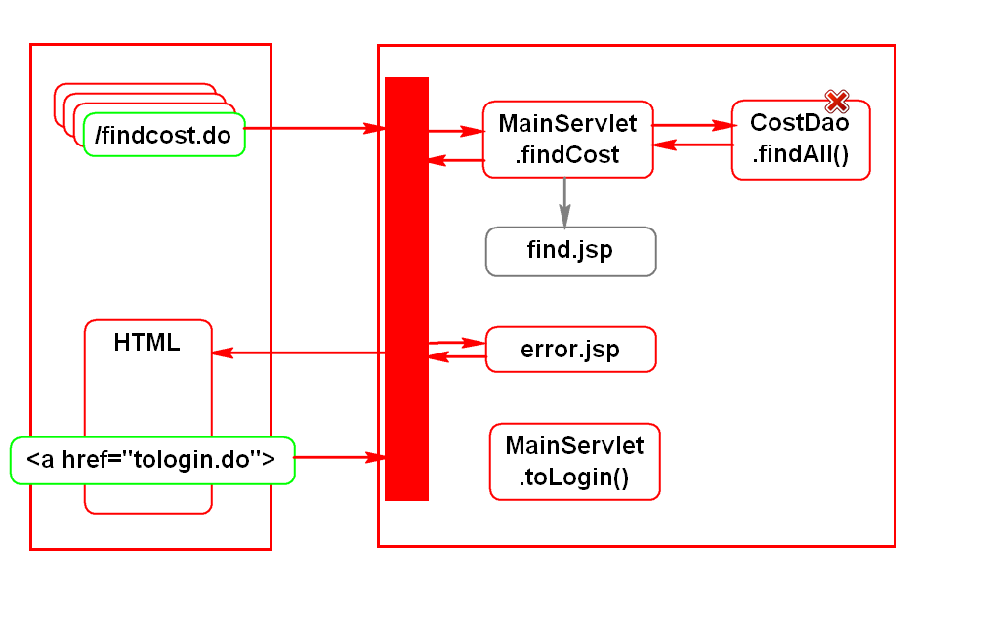
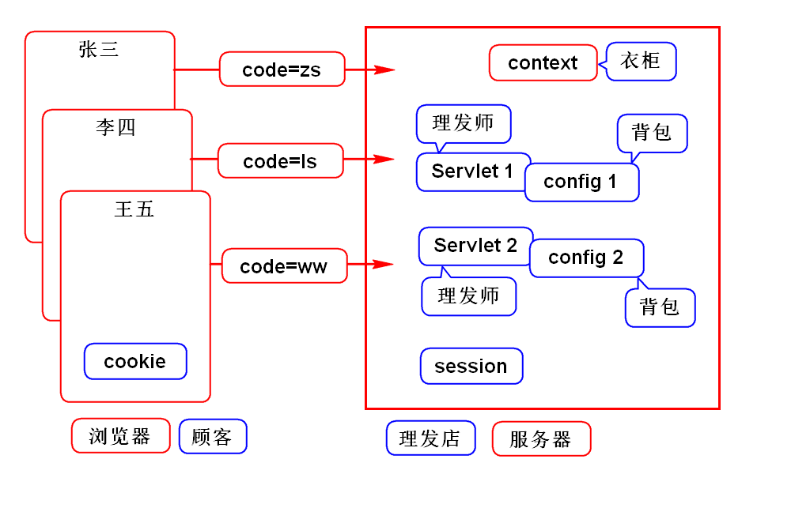
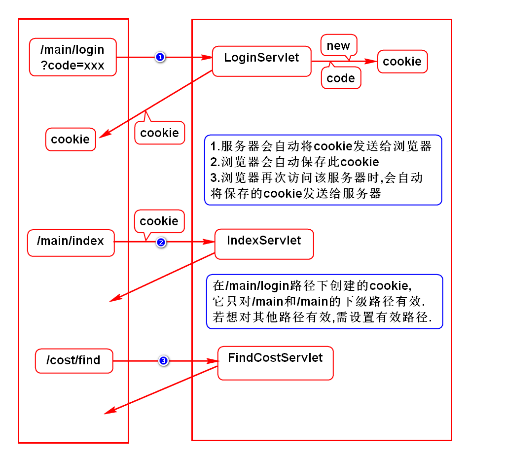
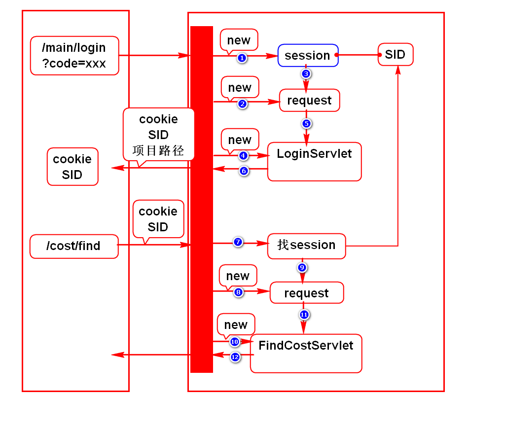

# 一.完善NETCTOSS功能
## 1.登录失败时保留账号密码

## 2.菜单栏的路径问题

## 3.错误页面的路径问题

# 二.cookie和session
## 1.业务场景
- 登录时记录账号,在后续查询/增加/修改页面上显示此账号.

## 2.记录账号(错误的情况)
### request
- 登录是login.do,查询是findcost.do
- 它们是不同的请求,使用不同的request

### config
- 可能登录是LoginServlet,查询是FindCostServlet
- 它们是不同的Servlet,使用不同的config
> 实际上config只能读取常量,不能存取变量

### context
- context在一个项目中只有一个实例
- 多用户同时登录时,会将同名不同值的参数存入此对象,会产生冲突

## 3.记录账号(正确的情况)
- 使用cookie或session存储账号:
- 多次请求可以复用该对象中的数据.
- 多个Servlet之间可以复用该对象中的数据.
- 服务器会给每个浏览器创建一份cookie或session.
> 上述规则由服务器进行保障.

## 4.cookie和session的区别
- cookie存储在浏览器上,不安全,服务器压力小
- session存储在服务器上,安全,服务器压力大

# 三.cookie
## 1.基本语法
- 创建cookie:new Cookie(name,value)
- 发送cookie:response.addCookie(cookie)
- 获取cookie:request.getCookies()

## 2.相关规则
- 生存时间:cookie.setMaxAge(n)
- 中文编码:URLEncoder,URLDecoder
- 有效路径:cookie.setPath("")

# 四.session

